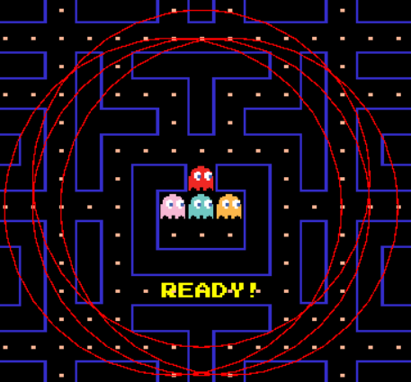
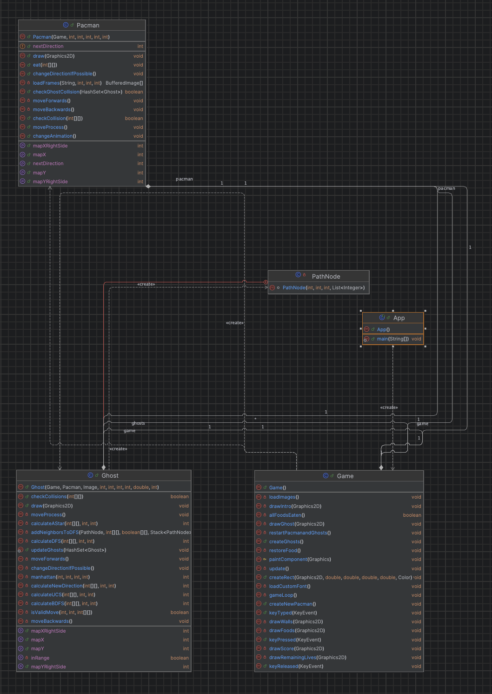

# Pacman Game 
<div id="header" align="center">
<!-- PROJECT LOGO -->
   
</div>
</br>

<!-- TABLE OF CONTENTS -->
# Table of Contents
  <ol>
    <li>
      <a href="#Introduction">Introduction</a>
      <ul>
        <li><a href="#Team-members">Team Members</a></li>
	<li><a href="#installation">Installation</a></li>
	<li><a href="#motivation">Motivation</a></li>
	<li><a href="#contribution-table">Contribution Table</a></li>      
      </ul>
    </li>
    <li><a href="#Tool-Used">Tool Used</a></li>
    <li><a href="#features">Features</a></li>
    <li><a href="#challenges">Challenges</a></li>
    <li><a href="#acknowledgments">Acknowledgments</a></li>
    <li><a href="#references">References</a></li>
  </ol>

<!-- ABOUT THE PROJECT -->
# Introduction 
<p align="justify">

</p>

<!-- TEAM MEMBERS -->
## Team Members 

| Order |         Name          |     ID      |                       Github account                        |
| :---: | :-------------------: | :---------: | :---------------------------------------------------------: |
|   1   | Pham Nguyen Tien Dat | ITDSIU21080 | [datpham18903](https://github.com/datpham18903) |
|   2   | Nguyen Hai Quan | ITITWE21104  | [haiquan009203](https://github.com/haiquan0092003) | 
|   3   | Duong Ngoc Phuong Anh | ITDSIU22135 |   [dngcphngnh04](https://github.com/dngcphngnh04) | 
|   4   | Nguyen Hai Phu | ITDSIU22179| |
|   5   | Nguyen Hoang Minh Khoi | ITCSIU22217 |  [Khoiiminh](https://github.com/Khoiiminh) | 


<!-- INSTALLATION -->
## Installation

1. **Install Java Development Kit (JDK)**:
   - Download and install the JDK from the [official Oracle website](https://www.oracle.com/java/technologies/javase-jdk11-downloads.html) or use a package manager like `brew` on macOS or `apt` on Ubuntu.
   - Ensure that the `JAVA_HOME` environment variable is set correctly and that the `java` and `javac` commands are available in your terminal.

2. **Clone the Repository**:
   - Open a terminal and run the following command to clone the repository:
     ```sh
     git clone https://github.com/datpham18903/Pac-Man.git 
     ```
   - Navigate to the project directory:
     ```sh
     cd Pac-Man
     ```

3. **Compile the Java Source Files**:
   - Compile the Java source files located in the [src] directory:
     ```sh
     javac -d bin src/*.java
     ```

4. **Run the Application**:
   - Run the compiled Java application:
     ```sh
     java -cp bin App
     ```

5. **Ensure Resources are Available**:
   - Make sure that the resource files (images and fonts) are correctly placed in the `resource` directory as specified in the code.

Enjoy your Pac-Man gaming experience! 


<!-- MOTIVATION -->
## Motivation 
We are working with this game as our project lab of Algorithms & Data Structures is a 4-credit course. During our investigation into how to create 2D games with Java, we made the decision to enhance the Pacman game, which was formerly quite well-known and familiar to many people.


</p>

<!-- CONTRIBUTION TABLE -->
## Contribution Table 
| Order | Full Name                                  |  ID   | Contribution (%) |
| :---- |:--------------------------------------| :-------: | :----------: |
| 1     |  Pham Nguyen Tien Dat |  ITDSIU21080  |      20      |
| 2     | Nguyen Hai Quan  | ITITWE21104 |      20      |
| 3     | Duong Ngoc Phuong Anh | ITDSIU22135 |      20      |
| 4     |  Nguyen Hai Phu| ITDSIU22179 |      20      |
| 5     | Nguyen Hoang Minh Khoi | ITCSIU22217 |      20      |


<!-- TOOL USED -->
## Tools Used

1. **Java Development Kit (JDK)**: The project is written in Java, so the JDK is required to compile and run the code.
2. **Swing**: Java's built-in library for creating graphical user interfaces (GUIs).
3. **AWT**: Java's Abstract Window Toolkit, used for creating graphical user interfaces and painting graphics.
4. **ImageIO**: Part of Java's standard library for reading and writing images.
5. **Timer**: Part of Java's `javax.swing` package, used for scheduling tasks.


<!-- FEATURES -->
# Features 
- About the rules to play
  - Pac-Man is an action maze chase video game; the player controls the eponymous character through an enclosed maze. The objective of the game is to eat all of the dots placed in the maze while avoiding four colored ghosts—Blinky (red), Pinky (pink), Inky (cyan), and Clyde (orange)—who pursue Pac-Man.
  - Each ghost will have a circle to determine if pacman is in that circle or not.
 
  - If pacman is NOT inside the circle, ghosts will move randomly. If yes, ghosts will chase pacman using different search algorithms
    + The Blinky - Uniform Cost Search ( UCS ).
    + The Pinky - Depth First Search ( DFS ).
    + Inky - A* Search.
    + Clyde - Breadth First Search (BFS).

- Design
  

----------------------------------------


- UML



<!-- CHALLENGES -->
# Challenges
- Interacting with Pre-existing Code: The established codebase was complex to comprehend and modify. At times, the rigidity of the classes and packages made the implementation of new features challenging.
- Difficulty Calibration: Striking an optimal balance to ensure the game is engaging yet not overly difficult for players was a demanding task.


<!-- ACKNOWLEDGMENTS -->
# Acknowledgments
- The team would like to extend heartfelt gratitude to our lecturers, Dr. Tran Thanh Tung and MSc. Thai Trung Tin, for their invaluable guidance and support throughout this project. 
- We wish to express our profound appreciation to everyone who played a part in the successful completion of our DSA game project. This adventure has been immensely fulfilling, and the contributions of each team member have been indispensable.
- Our friends’ feedback and suggestions have been invaluable. Their perspectives have greatly enhanced the gaming experience. 
- This project makes use of numerous open-source tools, OpenAI, and libraries. We express our deep gratitude to the developers and maintainers of these resources. Their contributions have been crucial in making our game a reality.


<p align="justify">

</p>

<!-- REFERENCES -->
# References
- Kenny Yip Coding. (2024, October 21). Code Pacman in Java [Video]. YouTube. https://www.youtube.com/watch?v=lB_J-VNMVpE.
- Servet Gulnaroglu. (2022, November 17). ASMR Programming - Coding Pacman - No Talking [Video]. YouTube. https://www.youtube.com/watch?v=GXlckaGr0Eo. 
- Coder Ph. (2020, November 9). HOW TO MAKE a PACMAN GAME IN JAVA LANGUAGE - PROGRAMMING TUTORIAL FOR BEGINNERS | CS Programmer [Video]. YouTube. https://www.youtube.com/watch?v=pw-1z5SmXQk. 
- Tovmasyan, T. (2021, December 16). AI and PacMan (A story of ghosts’ intelligence) - Tatevik Tovmasyan - Medium. Medium. https://tateviktome-tovmasyan.medium.com/ai-and-pacman-a-story-of-ghosts-intelligence-d2f296c31675. 


<p align="right">(<a href="#header">Back to top</a>)</p>