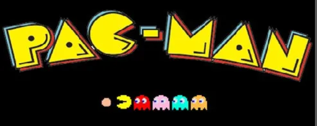
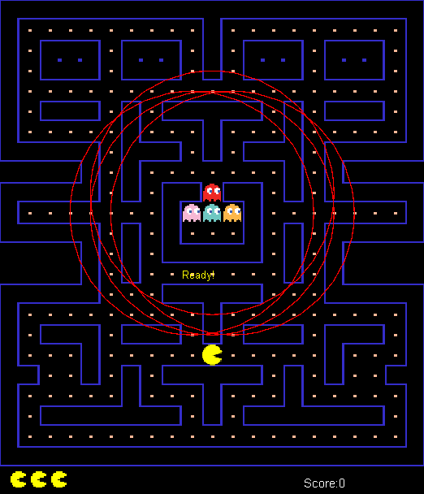
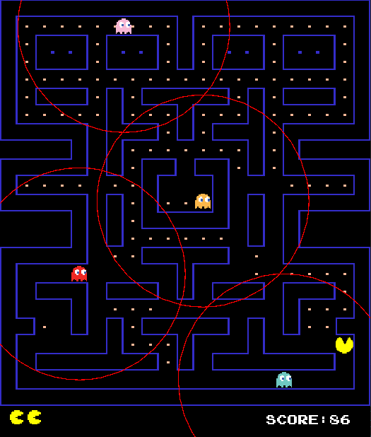

# Pacman Game 

<!-- PROJECT LOGO -->
   

 

<!-- TABLE OF CONTENTS -->
# Table of Contents
  <ol>
    <li>
      <a href="#Introduction">Introduction</a>
      <ul>
        <li><a href="#Team-members">Team Members</a></li>
	<li><a href="#installation">Installation</a></li>
	<li><a href="#motivation">Motivation</a></li>
	<li><a href="#task-allocation">Task Allocation</a></li>      
      </ul>
    </li>
    <li><a href="#Tool-Used">Tool Used</a></li>
    <li><a href="#features">Features</a></li>
    <li><a href="#challenges">Challenges</a></li>
    <li><a href="#acknowledgments">Acknowledgments</a></li>
    <li><a href="#references">References</a></li>
  </ol>

<!-- ABOUT THE PROJECT -->
# Introduction 

<!-- TEAM MEMBERS -->
## Team Members 

| Order |         Name          |     ID      |                  Email                  |                       Github account                        |                              Facebook                              |
| :---: | :-------------------: | :---------: |:---------------------------------------:| :---------------------------------------------------------: | :----------------------------------------------------------------: |

<!-- INSTALLATION -->
## Installation 
*Prerequisites*: Make sure that the following dependencies are installed on your machine:
-  ???

<!-- MOTIVATION -->
## Motivation 
We are working with this game as our project lab of Algorithms & Data Structures is a 4-credit course. During our investigation into how to create 2D games with Java, we made the decision to enhance the Pacman game, which was formerly quite well-known and familiar to many people.

<!-- TASK ALLOCATION -->
## Task Allocation 
| Order | Task                                  |  Person   | Contribution (%) |
| :---- |:--------------------------------------| :-------: | :----------: |
-đợi reporreport

<!-- TOOL USED -->
# Tool Used 
- ???

<!-- FEATURES -->
# Features 
- About the rules to play
  - Pac-Man is an action maze chase video game; the player controls the eponymous character through an enclosed maze. The objective of the game is to eat all of the dots placed in the maze while avoiding four colored ghosts—Blinky (red), Pinky (pink), Inky (cyan), and Clyde (orange)—who pursue Pac-Man.
  - Each ghost will have a circle to determine if pacman is in that circle or not. If not, ghosts will move randomly. If yes, ghosts will chase pacman using different search algorithms
    + The Blinky - Uniform Cost Search ( UCS ).
    + The Pinky - Depth First Search ( DFS ).
    + Inky - A* Search.
    + Clyde - Breadth First Search (BDFS).

- Design
  

----------------------------------------

- UML
???

<!-- CHALLENGES -->
# Challenges
- Interacting with Pre-existing Code: The established codebase was complex to comprehend and modify. At times, the rigidity of the classes and packages made the implementation of new features challenging.
- Difficulty Calibration: Striking an optimal balance to ensure the game is engaging yet not overly difficult for players was a demanding task.

<!-- ACKNOWLEDGMENTS -->
# Acknowledgments
- We wish to express our profound appreciation to everyone who played a part in the successful completion of our DSA game project. This adventure has been immensely fulfilling, and the contributions of each team member have been indispensable.
- Our friends’ feedback and suggestions have been invaluable. Their perspectives have greatly enhanced the gaming experience. We extend our thanks to our beta testers who generously offered their time to aid us in perfecting our game. 
- [!IMPORTANT]
This project makes use of numerous open-source tools, OpenAI, and libraries. We express our deep gratitude to the developers and maintainers of these resources. Their contributions have been crucial in making our game a reality.

<!-- REFERENCES -->
# References

(<a href="#header">Back to top</a>)
