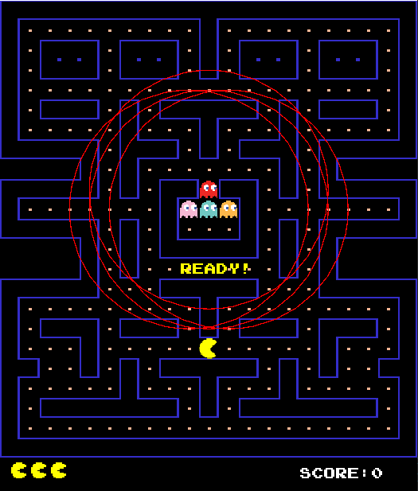

# Pacman Game 
<div id="header" align="center">
<!-- PROJECT LOGO -->
   
</div>
</br>

<!-- TABLE OF CONTENTS -->
# Table of Contents
  <ol>
    <li>
      <a href="#Introduction">Introduction</a>
      <ul>
        <li><a href="#Team-members">Team Members</a></li>
	<li><a href="#installation">Installation</a></li>
	<li><a href="#motivation">Motivation</a></li>
	<li><a href="#task-allocation">Task Allocation</a></li>      
      </ul>
    </li>
    <li><a href="#Tool-Used">Tool Used</a></li>
    <li><a href="#features">Features</a></li>
    <li><a href="#challenges">Challenges</a></li>
    <li><a href="#acknowledgments">Acknowledgments</a></li>
    <li><a href="#references">References</a></li>
  </ol>

<!-- ABOUT THE PROJECT -->
# Introduction 
<p align="justify">

</p>

<!-- TEAM MEMBERS -->
## Team Members 

| Order |         Name          |     ID      |                  Email                  |                       Github account                        |                              Facebook                              |
| :---: | :-------------------: | :---------: |:---------------------------------------:| :---------------------------------------------------------: | :----------------------------------------------------------------: |


<!-- INSTALLATION -->
## Installation

### Prerequisites

Ensure your system has the following installed:

- **Java Development Kit (JDK) 21**: [Download from Oracle](https://www.oracle.com/java/technologies/javase/jdk21-archive-downloads.html).

- **JavaFX**: [Download from Gluon](https://gluonhq.com/products/javafx/).

- **Git**: [Download from Git SCM](https://git-scm.com/downloads).

### Installation Steps

1. **Clone the Repository**:

   ```bash
   git clone https://github.com/datpham18903/Pac-Man.git
   ```

2. **Navigate to the Project Directory**:

   ```bash
   cd Pac-Man
   ```

3. **Set Up JavaFX**:

   - **Download JavaFX SDK**:

     - Visit the [Gluon website](https://gluonhq.com/products/javafx/).

     - Download the JavaFX SDK suitable for your operating system.

   - **Configure JavaFX in Your IDE**:

     - **For IntelliJ IDEA**:

       - Open **File > Project Structure > Libraries**.

       - Click **+** and add the path to the JavaFX SDK's `lib` directory.

     - **For Eclipse**:

       - Right-click on the project and select **Properties**.

       - Navigate to **Java Build Path > Libraries**.

       - Click **Add External JARs** and select all JAR files in the JavaFX SDK's `lib` directory.

4. **Build and Run the Project**:

   - **Using IntelliJ IDEA**:

     - Open the project.

     - Ensure JDK 21 is set as the project SDK.

     - Configure run configurations to include JavaFX libraries:

       - Go to **Run > Edit Configurations**.

       - In **VM options**, add:

         ```bash
         --module-path /path/to/javafx-sdk/lib --add-modules javafx.controls,javafx.fxml
         ```

     - Click **Run** to start the game.

   - **Using Command Line**:

     - Compile the project:

       ```bash
       javac --module-path /path/to/javafx-sdk/lib --add-modules javafx.controls,javafx.fxml -d bin src/*.java
       ```

     - Run the project:

       ```bash
       java --module-path /path/to/javafx-sdk/lib --add-modules javafx.controls,javafx.fxml -cp bin Main
       ```

### Troubleshooting

- **JavaFX Runtime Components Missing**: Ensure JavaFX is correctly configured in your IDE or command line setup.

- **Unsupported Java Version**: Verify that JDK 21 is installed and set as the project SDK.

- **Compilation Errors**: Check for missing dependencies or incorrect file paths.

For further assistance, refer to the [official JavaFX documentation](https://openjfx.io/) or consult community forums.

*Note: Replace `/path/to/javafx-sdk/lib` with the actual path to your JavaFX SDK's `lib` directory.*

Enjoy your Pac-Man gaming experience! 


<!-- MOTIVATION -->
## Motivation 
We are working with this game as our project lab of Algorithms & Data Structures is a 4-credit course. During our investigation into how to create 2D games with Java, we made the decision to enhance the Pacman game, which was formerly quite well-known and familiar to many people.


</p>

<!-- TASK ALLOCATION -->
## Task Allocation 
| Order | Task                                  |  Person   | Contribution (%) |
| :---- |:--------------------------------------| :-------: | :----------: |
-đợi reporreport

<!-- TOOL USED -->
# Tool Used 
- Java 21 
- Javafx
- Paint
- Java 2D


<!-- FEATURES -->
# Features 
- About the rules to play
  - Pac-Man is an action maze chase video game; the player controls the eponymous character through an enclosed maze. The objective of the game is to eat all of the dots placed in the maze while avoiding four colored ghosts—Blinky (red), Pinky (pink), Inky (cyan), and Clyde (orange)—who pursue Pac-Man.
  - Each ghost will have a circle to determine if pacman is in that circle or not.
 
  - If pacman is NOT inside the circle, ghosts will move randomly. If yes, ghosts will chase pacman using different search algorithms
    + The Blinky - Uniform Cost Search ( UCS ).
    + The Pinky - Depth First Search ( DFS ).
    + Inky - A* Search.
    + Clyde - Breadth First Search (BDFS).

- Design
  

----------------------------------------


- UML
???


<!-- CHALLENGES -->
# Challenges
- Interacting with Pre-existing Code: The established codebase was complex to comprehend and modify. At times, the rigidity of the classes and packages made the implementation of new features challenging.
- Difficulty Calibration: Striking an optimal balance to ensure the game is engaging yet not overly difficult for players was a demanding task.


<!-- ACKNOWLEDGMENTS -->
# Acknowledgments
- We wish to express our profound appreciation to everyone who played a part in the successful completion of our DSA game project. This adventure has been immensely fulfilling, and the contributions of each team member have been indispensable.
- Our friends’ feedback and suggestions have been invaluable. Their perspectives have greatly enhanced the gaming experience. We extend our thanks to our beta testers who generously offered their time to aid us in perfecting our game. 
- [!IMPORTANT]
This project makes use of numerous open-source tools, OpenAI, and libraries. We express our deep gratitude to the developers and maintainers of these resources. Their contributions have been crucial in making our game a reality.


<p align="justify">

</p>

<!-- REFERENCES -->
# References


<p align="right">(<a href="#header">Back to top</a>)</p>